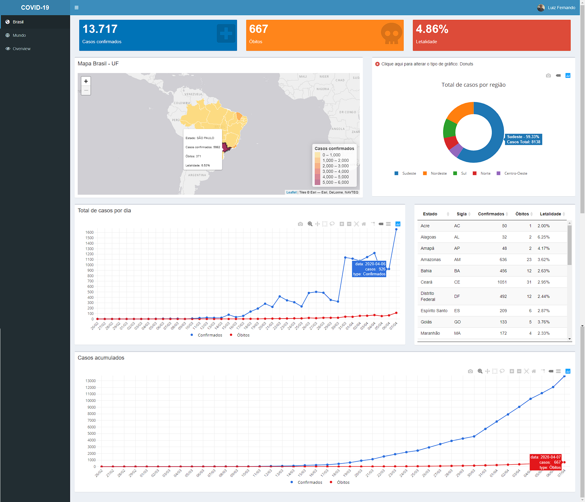
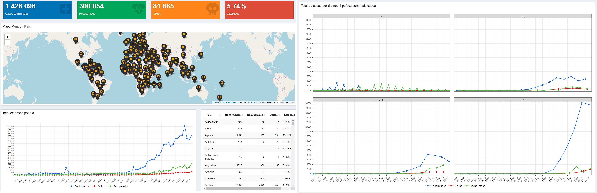

# Covid-19 dashboard

Este [dashboard do Covid-19](https://luizfcp.shinyapps.io/covid19/) fornece uma visão geral da pandemiaprovocada pelo novo coronavírus (COVID-19) no Brasil e no Mundo. Este dashboard foi feito com a linguagem de programação R (version 3.6.3) utilizando o pacote Shiny.

#### Brasil

#### Mundo

## Dados

Os dados utilizados nas análises para este dashboard se encontram em <a href='https://covid.saude.gov.br/'>Painel coronavírus no Brasil pelo Ministério da Saúde</a> e <a href='https://covid19r.github.io/coronavirus/'>coronavirus R package</a>.

## Pacotes

**Interface:** [shinydashboardPlus](https://rinterface.github.io/shinydashboardPlus/)  
**Tabelas:** [DT](https://rstudio.github.io/DT/)  
**Visualização:**   
- Gráficos: [ggplot2](https://ggplot2.tidyverse.org/) e [plotly](https://plotly.com/r/)  
- Mapas: [leaflet](https://rstudio.github.io/leaflet/)
